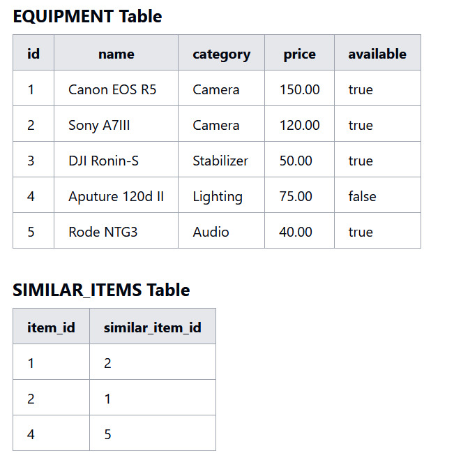
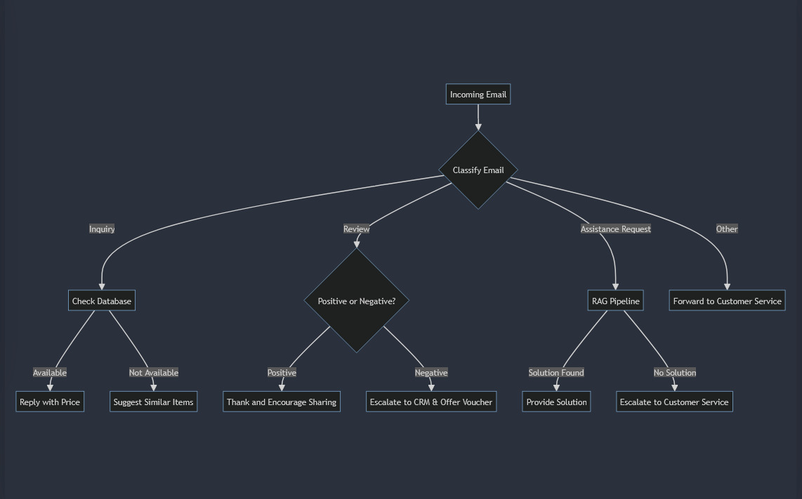
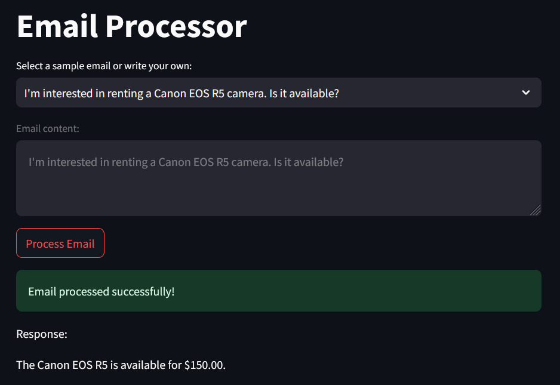
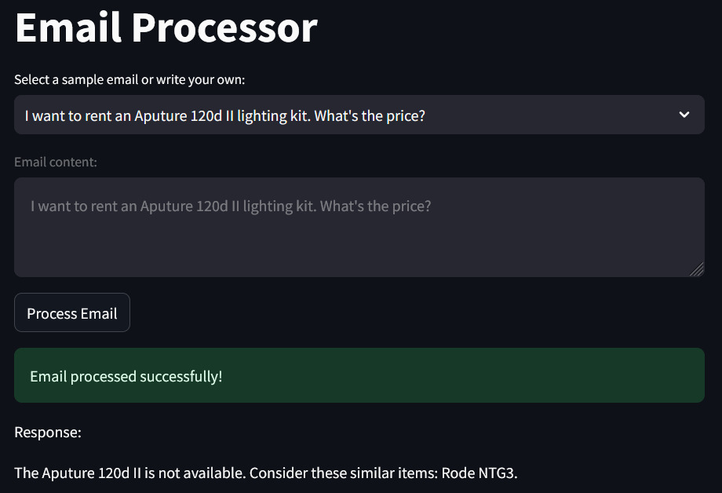
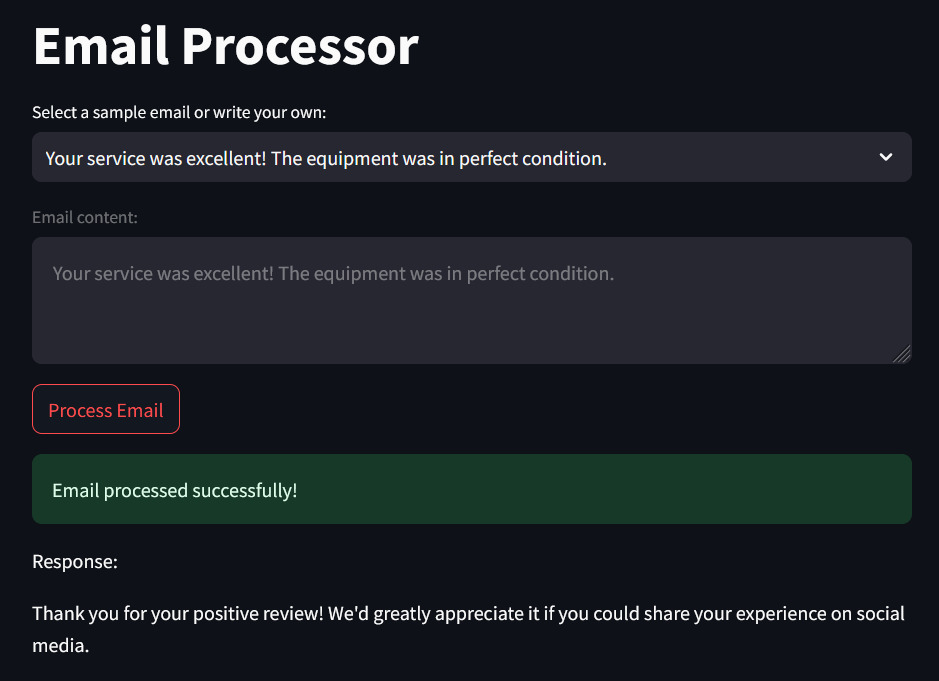
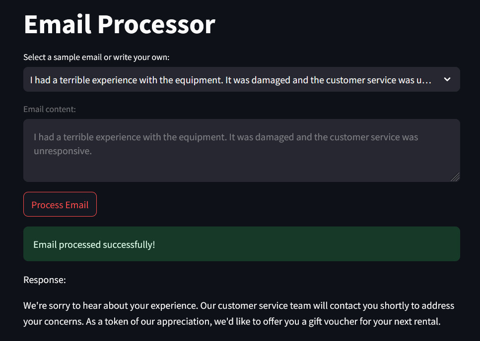
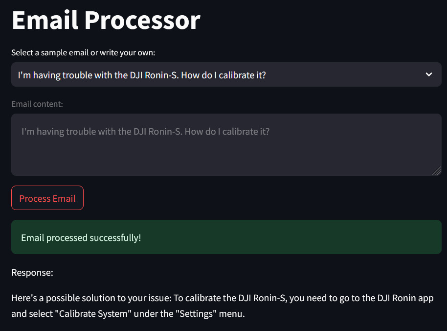
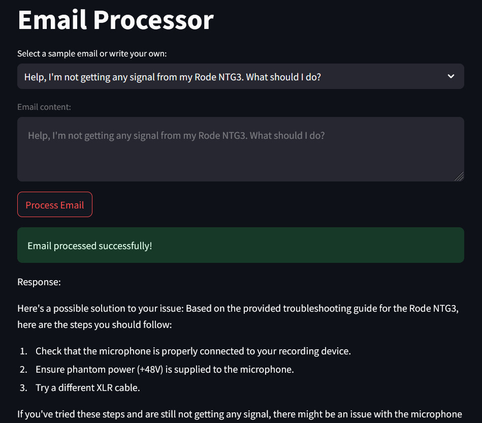

# Storyvord Internship Assignment

## Project Title
Automatic Email Reply System for Film Equipment Rental Service

## Objective
Design and implement a Langchain based system that classifies incoming emails into three categories and executes specific actions based on the category. The system should enhance customer interaction by providing automated responses tailored to inquiries, reviews, and assistance requests.

## Deliverables

1. **Database Schema and Implementation**

  

  The dummy data was generated by ChatGPT. I used the sqlite3 python module to initialize a database for this dummy data, check out the `init_db.py` file for more information.

  - **Equipment Table** : This is the main table that stores information about each piece of equipment. The fields are id (Primary Key), name, category, price and availability.
  - **Similar Items Table** : This table establishes relationships between similar pieces of equipment. The fields are item_id (Foreign Key to id) and similar_item_id (Foreign Key to id).

2. **RAG Pipeline Document**

   The code sets up a Retrieval-Augmented Generation (RAG) pipeline to handle email processing. It uses the HuggingFaceEmbeddings to convert documents into embeddings. Specifically, it loads FAQ data from a markdown file, `equipment_faq.md` using a TextLoader. The text is then split into chunks of 1000 characters each using CharacterTextSplitter. These chunks are converted into embeddings by the HuggingFaceEmbeddings and stored in a Chroma vector store, which is subsequently used as a retriever. The retriever is integrated into a RetrievalQA chain with the Groq language model, enabling the system to refer to the embedded FAQ data to generate relevant responses based on the email content. This setup ensures that when an email falls into the `Assistance Request` category, the system retrieves and generates answers using the processed FAQ data.

3. **Flowchart**

   

## Sample Outputs

<table>
  <tr>
    <td></td>
    <td></td>
  </tr>
  <tr>
    <td></td>
    <td></td>
  </tr>
  <tr>
    <td></td>
    <td></td>
  </tr>
</table>
